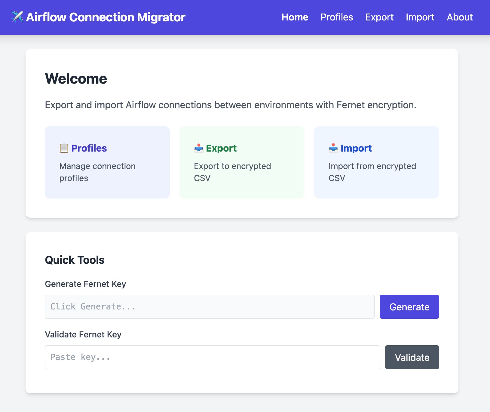
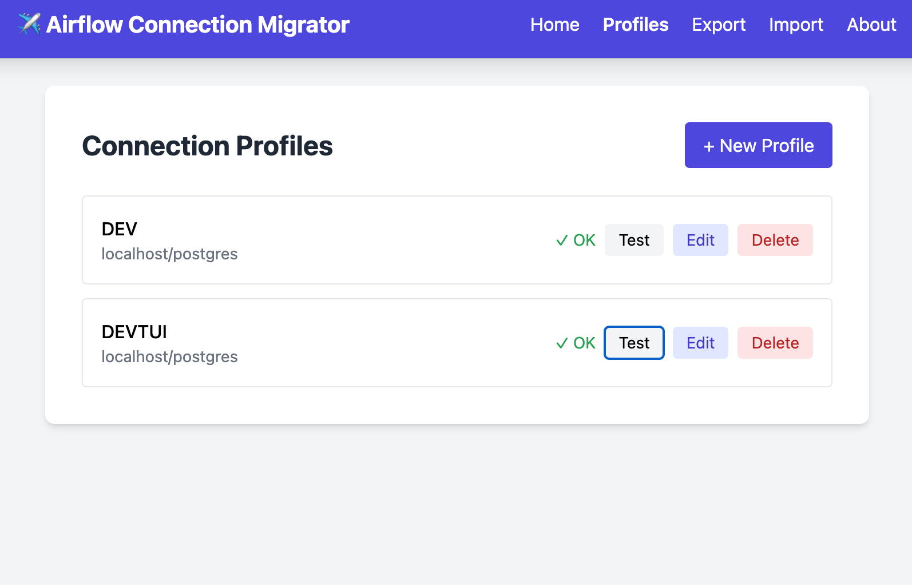
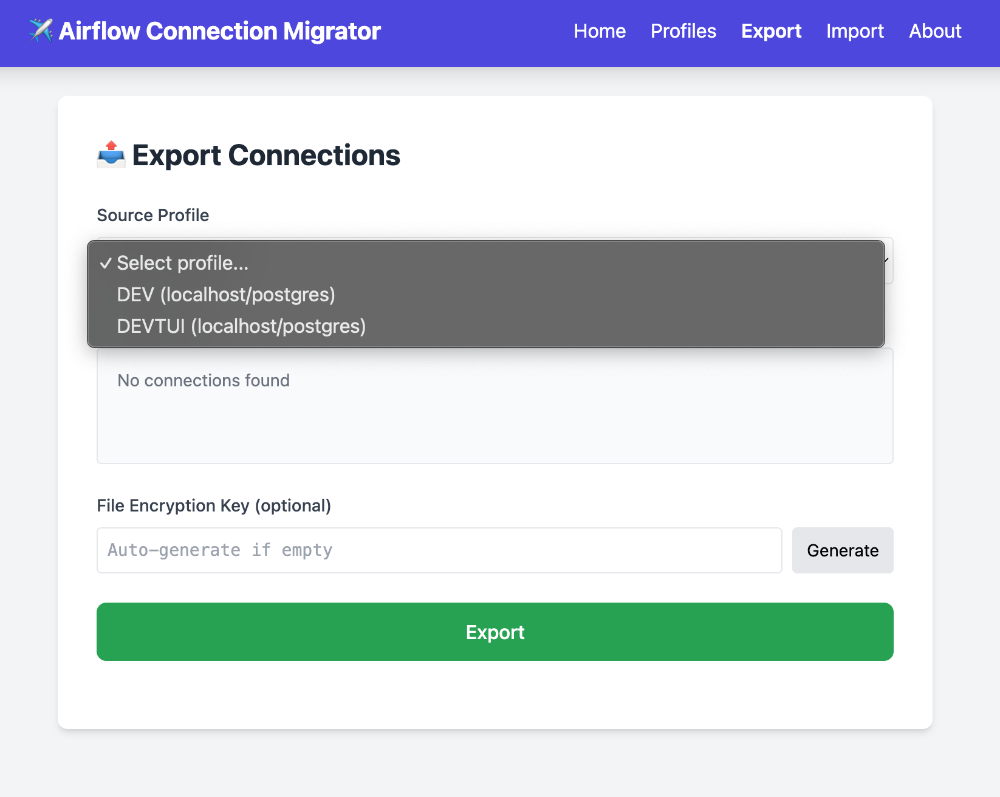
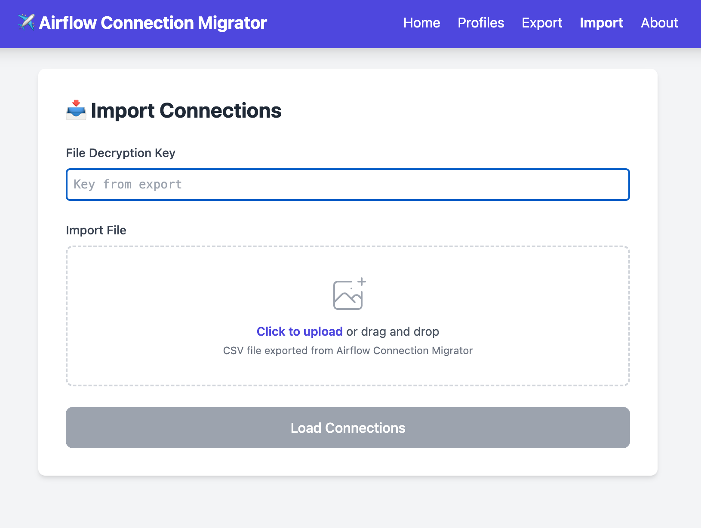
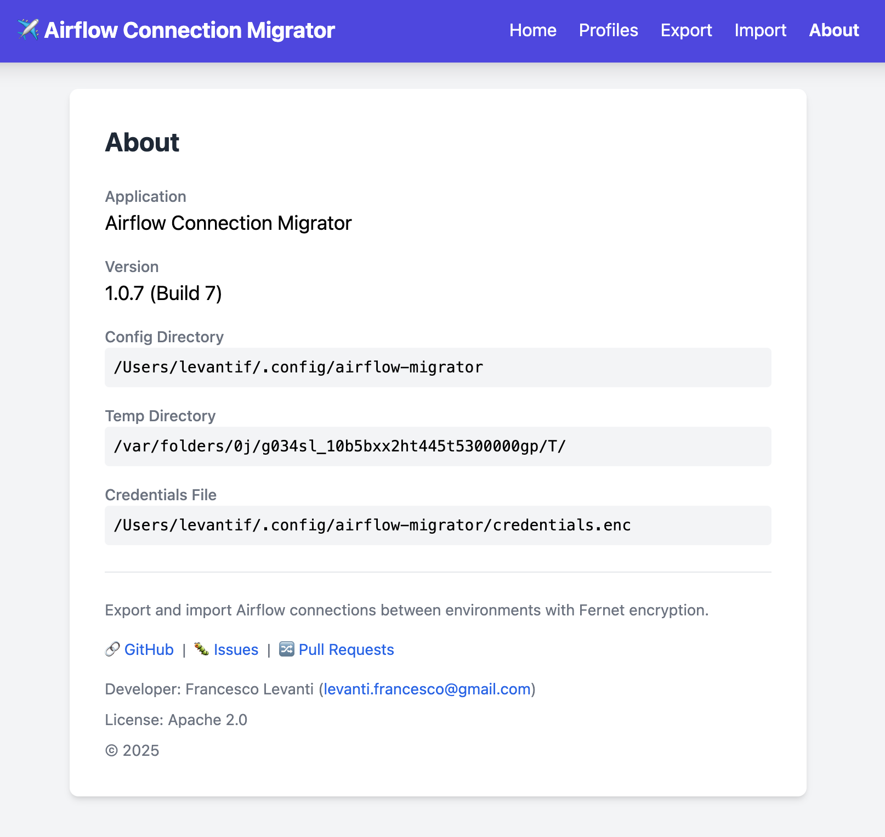
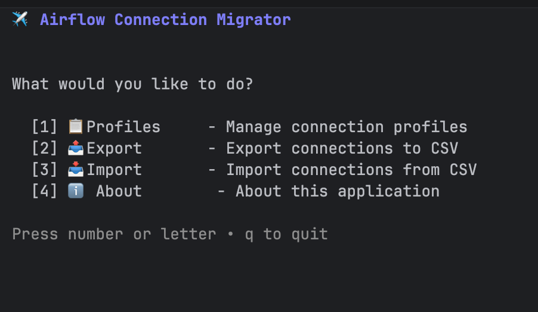
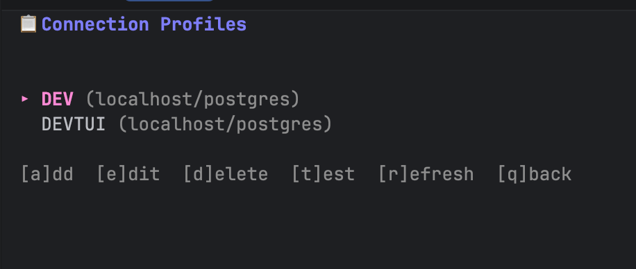
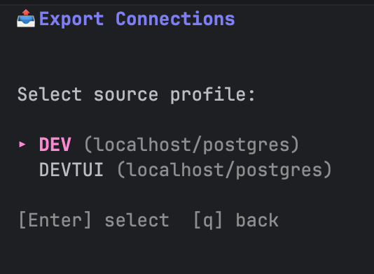
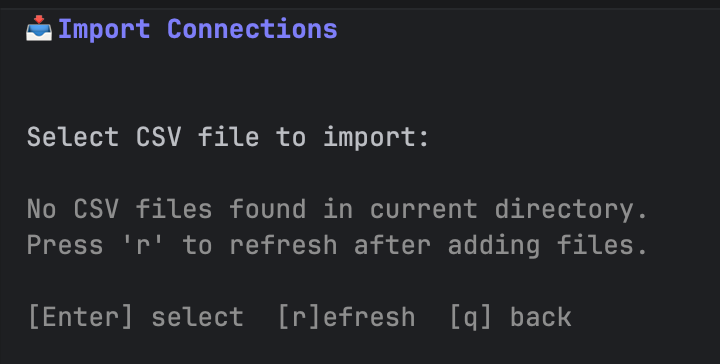
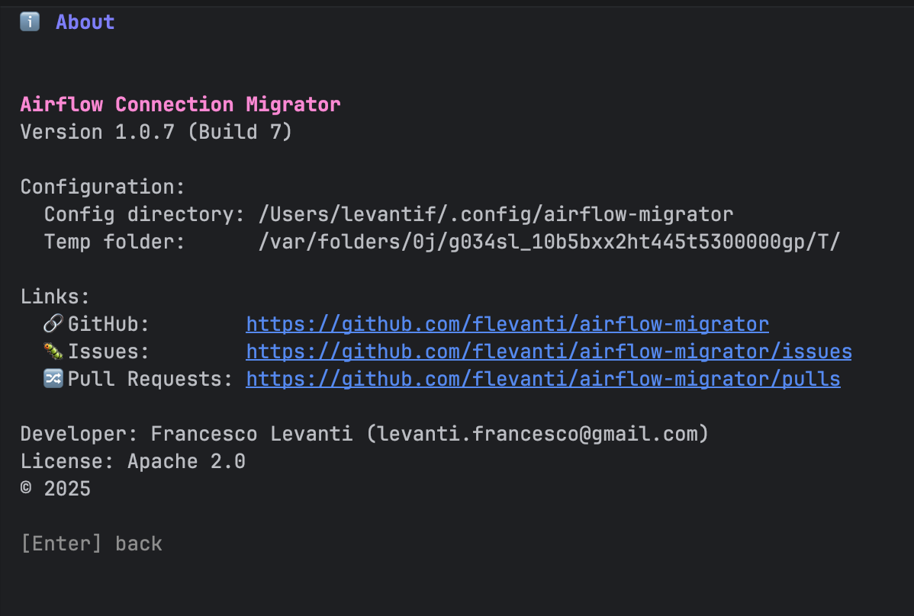

# Airflow Connection Migrator

A secure tool for exporting and importing Apache Airflow connections between environments. Encrypt your database
credentials with Fernet encryption (Python-compatible) and safely migrate connections across development, staging, and
production Airflow deployments.

## Implementations

This tool is available in three different implementations:

| Implementation | Interface         | Repository                                                                                         |
|----------------|-------------------|----------------------------------------------------------------------------------------------------|
| **Python**     | CLI               | [airflow_connections_import_export](https://github.com/flevanti/airflow_connections_import_export) |
| **Swift**      | Native macOS app  | [AirflowConnectionMigrator](https://github.com/flevanti/AirflowConnectionMigrator)                 |
| **Go**         | Web server or TUI | [airflow-migrator](https://github.com/flevanti/airflow-migrator)                                   |

All implementations share the same Fernet encryption format, so exported files are interchangeable between them.
> As part of the Swift implementation, a standalone Fernet encryption library was developed and
> released: [SwiftFernet](https://github.com/flevanti/SwiftFernet)

## Overview

Managing Airflow connections across multiple environments can be challenging. Connection details often contain sensitive
credentials that need to be handled securely. This tool provides:

- **Secure Export**: Export connections from any Airflow metadata database with Fernet encryption
- **Safe Import**: Import connections to target environments with collision handling strategies
- **Profile Management**: Save and manage multiple Airflow environment configurations
- **Python Compatibility**: Uses the same Fernet encryption as Airflow, ensuring compatibility

## Features

- **Fernet Encryption**: Industry-standard encryption compatible with Python's cryptography library
- **Profile Management**: Store multiple Airflow database configurations securely
- **Flexible Export**: Select specific connections or export all
- **Smart Import**: Skip, overwrite, or stop on collision with existing connections
- **Secure Storage**: Master password protection for stored credentials
- **Dual Interface**: Choose between Web UI or Terminal UI

## Installation

### Prerequisites

- Go 1.21 or later
- Access to Airflow metadata PostgreSQL database(s)

### Build from Source

```bash
git clone https://github.com/flevanti/airflow-migrator.git
cd airflow-migrator

# Build web server
go build -o airflow-migrator-web ./cmd/server

# Build TUI
go build -o airflow-migrator-tui ./cmd/tui
```

## Usage

The tool can be used in two ways:

| Mode           | Best For                                                   |
|----------------|------------------------------------------------------------|
| **Web Server** | Teams, browser-based workflow, drag-and-drop file handling |
| **TUI**        | Command-line users, SSH sessions, quick operations         |

Both interfaces share the same core functionality and encrypted profile storage.

---

## Web Server

The web interface provides a browser-based experience with an intuitive UI built with HTMX and Tailwind CSS.

### Starting the Server

```bash
# Default: localhost:8080
./airflow-migrator-web

# Custom port
./airflow-migrator-web -port 3000

# Custom bind address (use with caution)
./airflow-migrator-web -addr 0.0.0.0 -port 8080
```

On first run, you'll be prompted to create a master password to encrypt your stored credentials.

### Screenshots

<p align="center">
  <a href="readme.images/web1.png"></a>
  <a href="readme.images/web2.png"></a>
  <a href="readme.images/web3.png"></a>
  <a href="readme.images/web4.png"></a>
  <a href="readme.images/web5.png"></a>
</p>

### Web Features

- **Drag & Drop Import**: Drop CSV files directly onto the import page
- **Auto-download**: Exported files download automatically
- **Real-time Validation**: Fernet keys validated as you type
- **Connection Testing**: Test database connectivity before export/import

---

## Terminal UI (TUI)

The TUI provides a keyboard-driven interface for terminal environments, built with Bubble Tea.

### Starting the TUI

```bash
./airflow-migrator-tui
```

On first run, you'll be prompted to create a master password to encrypt your stored credentials.

### Screenshots

<p align="center">
  <a href="readme.images/tui1.png"></a>
  <a href="readme.images/tui2.png"></a>
  <a href="readme.images/tui3.png"></a>
  <a href="readme.images/tui4.png"></a>
  <a href="readme.images/tui5.png"></a>
</p>

### TUI Keyboard Shortcuts

| Context       | Key            | Action                       |
|---------------|----------------|------------------------------|
| Navigation    | `↑/↓` or `j/k` | Move cursor                  |
| Navigation    | `Enter`        | Select                       |
| Navigation    | `Esc` or `q`   | Back / Quit                  |
| Lists         | `Space`        | Toggle selection             |
| Lists         | `a`            | Select all                   |
| Lists         | `n`            | Select none                  |
| Profiles      | `a`            | Add profile                  |
| Profiles      | `e`            | Edit profile                 |
| Profiles      | `d`            | Delete profile               |
| Profiles      | `t`            | Test connection              |
| Forms         | `Tab`          | Next field                   |
| Forms         | `Ctrl+S`       | Save                         |
| Export Result | `c`            | Copy Fernet key to clipboard |

---

## Workflow

### Export Connections

1. **Select Profile**: Choose the source Airflow environment
2. **Select Connections**: Pick which connections to export (all selected by default)
3. **Set Encryption Key**: Enter a Fernet key or auto-generate one
4. **Export**: Creates an encrypted CSV file

> ⚠️ **Important**: Save the Fernet key! You'll need it to import the connections.

### Import Connections

1. **Select File**: Choose the encrypted CSV file
2. **Enter Fernet Key**: The key used during export
3. **Select Connections**: Pick which connections to import (none selected by default)
4. **Set Prefix** (optional): Add a prefix to connection IDs (e.g., `prod_`)
5. **Select Target Profile**: Choose the destination Airflow environment
6. **Collision Strategy**:
    - `skip`: Keep existing, import only new connections
    - `overwrite`: Replace existing connections with imported data
    - `stop`: Abort if any connection already exists
7. **Import**: Connections are decrypted and written to the target database

---

## Configuration

### Config Directory

Credentials and profiles are stored in:

- **Linux/macOS**: `~/.config/airflow-migrator/`
- **Custom**: Set `AIRFLOW_MIGRATOR_CONFIG` environment variable

### Files

| File              | Purpose                                         |
|-------------------|-------------------------------------------------|
| `credentials.enc` | Encrypted profile data (passwords, Fernet keys) |
| `salt.key`        | Salt for master password derivation             |

---

## Security

- **Master Password**: All stored credentials are encrypted with AES-256-GCM using a key derived from your master
  password (Argon2)
- **Fernet Encryption**: Export files use Python-compatible Fernet encryption
- **Local Binding**: Web server binds to localhost by default
- **No Telemetry**: No data is sent anywhere

---

## License

Apache 2.0

---

## Contributing

Contributions are welcome! Please open an issue or submit a pull request.

- 🐛 [Report Issues](https://github.com/flevanti/airflow-migrator/issues)
- 🔀 [Pull Requests](https://github.com/flevanti/airflow-migrator/pulls)